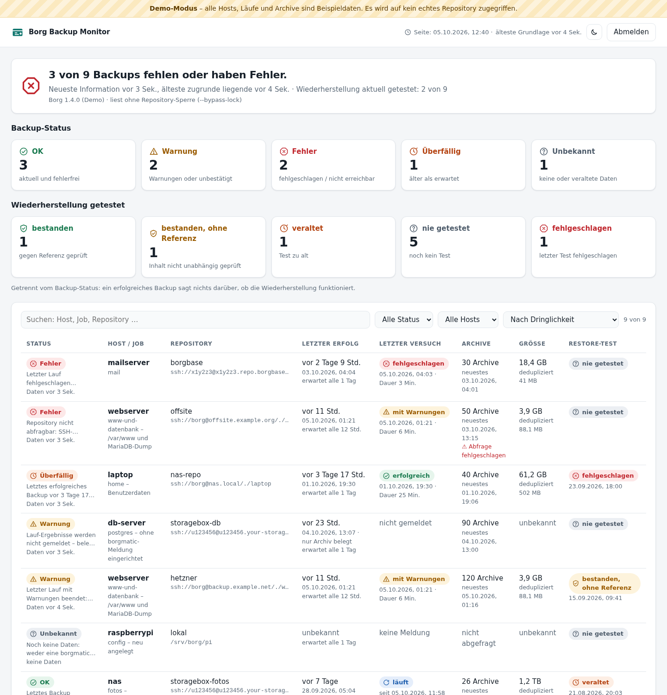
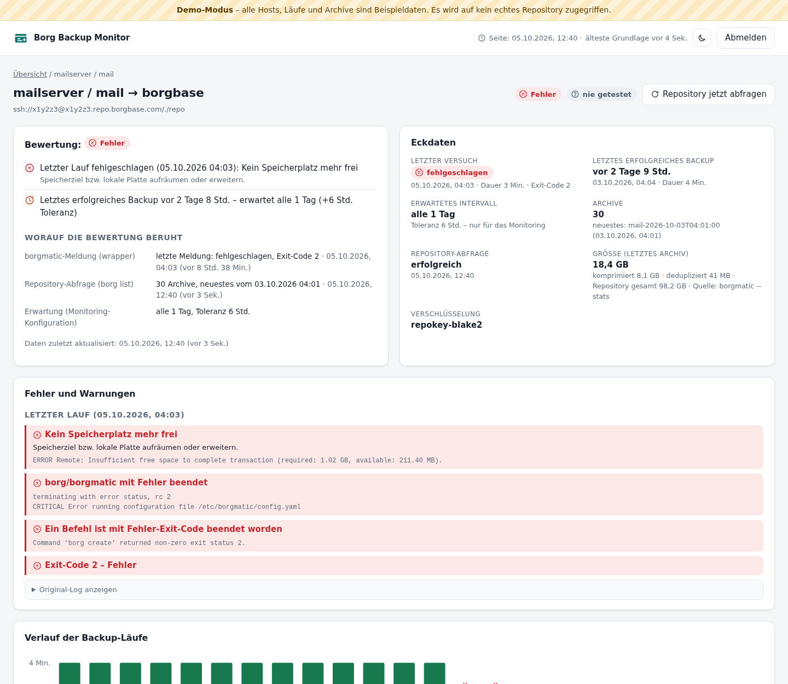
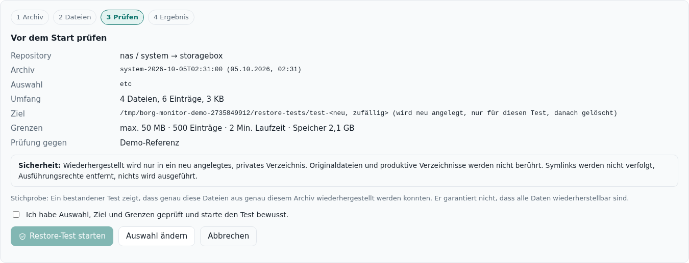

# Borg Backup Monitor

Grafische Weboberfläche zum **Überwachen** vorhandener [Borg](https://www.borgbackup.org/)- und [borgmatic](https://torsion.org/borgmatic/)-Backups. Auf einen Blick:

- **Welche Backups sind aktuell?**
- **Welche fehlen oder haben Fehler?**
- **Wie aktuell sind die Informationen?**
- **Wann wurde welche Wiederherstellung zuletzt erfolgreich getestet?**



> **Nur Monitoring.** Die Anwendung erstellt, startet, löscht, prunt, kompaktiert oder repariert keine Backups und ändert keine Konfiguration. Zeitpläne und borgmatic-Konfigurationen bleiben, wo sie sind. Die einzige aktive Funktion ist ein **kontrollierter Restore-Test** einzelner Dateien in ein isoliertes Temp-Verzeichnis.

## Inhalt

- [Schnellstart: Demo](#schnellstart-demo)
- [Installation mit docker compose](#installation-mit-docker-compose)
- [borgmatic melden lassen](#borgmatic-melden-lassen)
- [Wie der Status bewertet wird](#wie-der-status-bewertet-wird)
- [Restore-Test](#restore-test)
- [Sicherheit](#sicherheit)
- [Datenquellen und unterstützte Versionen](#datenquellen-und-unterstützte-versionen)
- [Technik und Begründung](#technik-und-begründung)
- [Fehlersuche](#fehlersuche)

## Schnellstart: Demo

Der Demo-Modus zeigt Beispieldaten (OK, Warnung, Fehler, überfällig, unbekannt, nicht erreichbares Repository, laufendes Backup, Restore-Tests in allen Zuständen) und ist auf jeder Seite deutlich als **Demo-Modus** gekennzeichnet. Es wird auf kein echtes Repository zugegriffen.

```bash
git clone https://github.com/daschmidt1994/borg-backup-monitor.git
cd borg-backup-monitor
docker compose --profile demo up -d demo
```

Dann <http://localhost:8081> öffnen, Anmeldung **demo / demo**. Auch der Restore-Test lässt sich dort vollständig durchspielen.

Ohne Docker: `go run ./cmd/borg-monitor -demo -listen 127.0.0.1:8081`

## Installation mit docker compose

Voraussetzung: Docker mit Compose-Plugin. Das Image enthält Borg 1.4, den SSH-Client und `prlimit`.

**1. Verzeichnisse und Konfiguration**

```bash
git clone https://github.com/daschmidt1994/borg-backup-monitor.git
cd borg-backup-monitor
cp config/config.example.yaml config/config.yaml
sudo chown -R 1000:1000 data   # der Container läuft als UID 1000 und schreibt nur nach data/
```

**2. Anmeldung einrichten** – Hash erzeugen und in `config.yaml` unter `auth.users` eintragen:

```bash
docker compose run --rm borg-monitor -hash-password
```

**3. Pro borgmatic-Konfiguration einen Job anlegen** und einen Ping-Token erzeugen:

```bash
docker compose run --rm borg-monitor -new-token
```

**4. Zugang zu den Repositorys** (nur, wenn Archive abgefragt werden sollen – empfohlen):

| Datei in `secrets/` | Inhalt |
|---|---|
| `nas.pass` | Passwort des Repositorys (eine Zeile) – alternativ `passcommand` |
| `id_ed25519_monitor` | eigener SSH-Schlüssel für den Monitor. Am Speicherziel per `command="borg serve --restrict-to-repository …"` auf genau dieses Repository beschränken |
| `known_hosts` | `ssh-keyscan -p 23 u123456.your-storagebox.de > secrets/known_hosts` – unbekannte Hosts werden abgelehnt |

Die Dateien müssen für den Container-Benutzer lesbar sein (Standard UID 1000, änderbar mit `BBM_UID`/`BBM_GID` in einer `.env`). Lokale Repositorys in `compose.yml` **nur lesend** (`:ro`) einbinden.

**5. Prüfen und starten**

```bash
docker compose run --rm borg-monitor -check-config
docker compose up -d
```

Die Oberfläche läuft auf <http://127.0.0.1:8080>. Für den Zugriff von außen einen Reverse-Proxy mit HTTPS davorsetzen (Caddy, Traefik, Nginx Proxy Manager) und `public_url` auf diese Adresse setzen – dann werden Cookies nur über HTTPS gesendet.

Image aus der GitHub Container Registry statt selbst bauen: in `compose.yml` `image: ghcr.io/daschmidt1994/borg-backup-monitor:latest` eintragen und `build: .` entfernen.

## borgmatic melden lassen

Ein Archiv im Repository beweist nicht, dass der Lauf fehlerfrei war. Deshalb meldet borgmatic jeden Lauf an den Monitor – über den **Healthchecks-Hook**, den borgmatic eingebaut hat. Die genaue Adresse und fertige Schnipsel stehen in der Job-Ansicht des Monitors.

**borgmatic ab 1.8** (in der jeweiligen borgmatic-Konfiguration):

```yaml
healthchecks:
    ping_url: https://backup-monitor.example.com/ping/<ping_token>
    states:
        - start
        - finish
        - fail
    send_logs: true
```

**Ältere Versionen** unter `hooks:`:

```yaml
hooks:
    healthchecks:
        ping_url: https://backup-monitor.example.com/ping/<ping_token>
        states: [start, finish, fail]
```

`start` liefert die Dauer, `send_logs` Fehlertexte, Warnungen und – mit `--stats` – die Größen.

**Alternative mit exaktem Exit-Code:** [`contrib/borgmatic-report.sh`](contrib/borgmatic-report.sh) ersetzt im bestehenden Cron-/systemd-Aufruf `borgmatic` und meldet Start, Exit-Code und Log:

```bash
BBM_PING_URL=https://backup-monitor.example.com/ping/<ping_token> borgmatic-report.sh --verbosity 1 --stats
```

Der Monitor selbst startet nie ein Backup.

Endpunkte (Healthchecks-kompatibel): `/ping/<token>` (Erfolg), `/start`, `/fail`, `/log`, `/<exit-code>`.

## Wie der Status bewertet wird

Jede Zeile ist ein **Repository eines Jobs** (Host → borgmatic-Konfiguration → Repository). Drei Quellen werden zusammen ausgewertet:

1. **Meldung von borgmatic** – Ergebnis, Exit-Code, Log (Fehler, Warnungen, `--stats`)
2. **Repository-Abfrage** – `borg list --json`: Anzahl und Zeit der Archive
3. **Erwartung** – Intervall und Toleranz, nur für das Monitoring konfiguriert

| Status | Bedeutung |
|---|---|
| ✓ **OK** | Letzter Lauf erfolgreich, innerhalb von Intervall + Toleranz, Archiv im Repository bestätigt |
| ! **Warnung** | Lauf mit Warnungen; nur ein Archiv ohne Lauf-Meldung („Ergebnis unbekannt“); Erfolg gemeldet, aber kein passendes Archiv; Lauf hängt |
| ✕ **Fehler** | Letzter Lauf fehlgeschlagen; Repository nicht erreichbar/abfragbar; noch nie ein erfolgreicher Lauf |
| ⏱ **Überfällig** | Letztes erfolgreiches Backup älter als Intervall + Toleranz |
| ? **Unbekannt** | Keine Daten, oder die Daten sind veraltet (Monitor konnte nicht abfragen) |

Grundsätze:

- **Ein nicht erreichbares Repository erscheint nie als gesund.** Der letzte bekannte Archivstand wird mit Datum angezeigt, aber als solcher gekennzeichnet.
- **Fehlende Information heißt „unbekannt“** – mit Erklärung, nie stillschweigend OK.
- Bei jedem Status steht **worauf er beruht** und **wann die Daten zuletzt aktualisiert** wurden. Die Kopfzeile zeigt die älteste zugrunde liegende Information.
- **Backup-Erfolg und getestete Wiederherstellbarkeit werden getrennt ausgewiesen.**
- Exit-Codes: `0` Erfolg, `1` Warnung, `2` Fehler; moderne Codes (Borg ≥ 1.4 mit `BORG_EXIT_CODES=modern`, Borg 2): `3–99` Fehler, `100–127` Warnung, `128+N` durch Signal N beendet.
- Bekannte Fehlermeldungen werden verständlich zusammengefasst (z. B. „Kein Speicherplatz mehr frei“, „SSH-Hostschlüssel unbekannt oder geändert“, „Passwort des Repositorys falsch“) – mit Hinweis und dem **Original-Log zum Aufklappen**.



## Restore-Test

Optional und nur manuell: Dateien aus einem gewählten Archiv probeweise wiederherstellen.

1. **Archiv wählen**, 2. **Dateien/Ordner wählen**, 3. **Plan prüfen** – Auswahl, Ziel, Umfang, Größen-, Zeit- und Speicherlimit und Referenz werden **vor dem Start** angezeigt und müssen bestätigt werden, 4. **Ergebnis**.



Schutzmaßnahmen:

- Wiederherstellung **nur in ein neu angelegtes, privates Verzeichnis** (`0700`) unter `restore.base_dir` – nie über Originaldateien, nie in produktive Verzeichnisse. Nach dem Test wird es gelöscht (`keep_files: false`).
- Pfade werden geprüft (kein `..`, keine Optionen); `borg extract` arbeitet relativ zum Testverzeichnis.
- Wiederhergestellte Dateien werden **nur gelesen** (Prüfsumme). Symlinks werden **nicht verfolgt**, Dateien mit `O_NOFOLLOW` geöffnet, Ausführungs- und setuid/setgid-Bits entfernt, Gerätedateien nie geöffnet.
- **Grenzen:** Größe (Vorabprüfung anhand der Archivliste plus Überwachung während des Entpackens), Anzahl Einträge, Laufzeit (Abbruch der ganzen Prozessgruppe), Speicher (`prlimit --as`), niedrige Priorität (`nice`). Nur ein Test gleichzeitig; nicht während eines laufenden Backups des Jobs.
- **Unabhängige Referenz:** `reference_checksums` (Datei im `sha256sum`-Format, auf dem Quellsystem erzeugt) und/oder `compare_root` (Originaldateien, nur lesend eingebunden; Abweichungen bei seither geänderten Dateien werden als solche gekennzeichnet). Ohne Referenz lautet das Ergebnis „bestanden, ohne Referenz“.
- Dokumentiert werden Zeitpunkt, Person, Archiv, Auswahl, Ziel, Grenzen, wiederhergestellte Dateien mit Größe und SHA-256, Abgleich, Fehler.

> **Ein bestandener Stichprobentest zeigt nur, dass genau diese Dateien aus genau diesem Archiv wiederhergestellt werden konnten. Er garantiert nicht, dass alle Daten wiederherstellbar sind.**

## Sicherheit

- **Zugangsschutz:** Benutzer mit bcrypt-Passwort-Hash; signierte Sitzungs-Cookies (`HttpOnly`, `SameSite=Strict`, `Secure` bei HTTPS); Begrenzung der Anmeldeversuche; CSRF-Schutz für alle ändernden Anfragen; strenge Content-Security-Policy, keine Inline-Skripte.
- **Geheimnisse bleiben auf dem Server:** Passwörter und SSH-Schlüssel werden nur als Dateipfade konfiguriert und ausschließlich dem borg-Prozess über die Umgebung übergeben – nie an den Browser, nie in Logs, nie als Kommandozeilenargument. Ping-Tokens werden in Logs maskiert.
- **Keine frei eingebbaren Befehle:** borg wird mit fest aufgebauten Argumentlisten ohne Shell aufgerufen; es gibt nur `list`, `info` und – für den Restore-Test – `extract`. Antworten werden nie mit „ja“ beantwortet (`BORG_RELOCATED_REPO_ACCESS_IS_OK=no` usw.).
- **Lesen blockiert keine Backups:** `--bypass-lock`, wo borg es unterstützt; Timeouts, begrenzte Ausgabe, begrenzte Parallelität, Abkühlzeit für manuelle Abfragen, Zwischenspeicherung. Teure Prüfungen (`borg check`, `borg info` mit Cache-Aufbau) werden nicht automatisch gestartet.
- **Container:** unprivilegierter Benutzer, schreibgeschütztes Dateisystem, keine Capabilities, `no-new-privileges`, Speicher- und Prozesslimit.

## Datenquellen und unterstützte Versionen

| | |
|---|---|
| Borg 1.1 – 1.4 | `borg list --json`, `borg info --json --last 1` (optional), `borg list --json-lines`, `borg extract`; Fehler strukturiert über `--log-json` (msgid) |
| Borg 2.x | `borg repo-list` (bzw. `rlist` früher Betas), Archiv per Name, Zeitstempel mit Zeitzone |
| borgmatic | jede Version mit Healthchecks-Hook; oder beliebig mit dem Wrapper-Skript |

Die installierte Version wird erkannt (`borg --version`, `--help`), ebenso ob `--bypass-lock` und die Extract-Optionen (`--noacls`, `--noxattrs`, `--noflags`) verfügbar sind. Fehlt eine Information – etwa Größen ohne `--stats` und ohne `sizes_interval` –, steht „unbekannt“ mit Erklärung.

Borg 1.x liefert Zeitstempel ohne Zeitzone; `time_zone` legt fest, wie sie zu lesen sind.

## Technik und Begründung

- **Go** für das Backend: eine einzelne, statisch gebaute Binärdatei ohne Laufzeitumgebung; kontrollierte Prozessaufrufe mit Timeouts und Prozessgruppen; nur zwei Abhängigkeiten (`yaml.v3`, `x/crypto/bcrypt`).
- **HTML, CSS und JavaScript ohne Framework und ohne Build-Schritt**, in die Binärdatei eingebettet – nichts zu kompilieren, keine npm-Abhängigkeiten, die veralten; Grafiken als SVG.
- **Zustand in einer JSON-Datei** (`data/state.json`, atomar geschrieben) – keine Datenbank, leicht zu sichern und zu lesen.
- **docker compose** für Betrieb und Demo; Multi-Arch-Image (amd64, arm64) aus GitHub Actions.

Entwicklung:

```bash
go test -race ./...
go run ./cmd/borg-monitor -demo
```

## Fehlersuche

| Meldung | Ursache |
|---|---|
| „SSH-Hostschlüssel unbekannt oder geändert“ | `known_hosts` fehlt oder passt nicht – mit `ssh-keyscan` erzeugen und prüfen |
| „Passwort des Repositorys falsch“ / „Kein Passwort verfügbar“ | `passphrase_file`/`passcommand` prüfen; Datei für UID 1000 lesbar? |
| „Repository gesperrt“ | borg ohne `--bypass-lock` (sehr alt) oder Lock vom Backup; später erneut abfragen |
| „Keine borgmatic-Meldung empfangen“ | Healthchecks-Hook fehlt oder erreicht den Monitor nicht (`public_url`, Reverse-Proxy, Firewall) |
| Dauer „unbekannt“ | borgmatic meldet `start` nicht – in `states` ergänzen |
| Größe „unbekannt“ | borgmatic mit `--stats` laufen lassen oder `borg.sizes_interval` setzen |
| Restore-Test: „Speicher nicht erzwungen“ | `prlimit` fehlt (außerhalb des Images: Paket util-linux) |

Mehr Ausgaben: `BBM_DEBUG=1`.

## Lizenz

[GNU Affero General Public License v3.0](LICENSE) (AGPL-3.0-only). Ohne Gewähr.
